# IoT-Robot

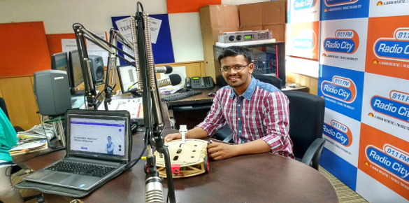

<!-- TOC -->

- [1. Demo](#1-demo)
- [2. Description](#2-description)
- [3. Software Versions](#3-software-versions)
- [4. Background/Motivation](#4-backgroundmotivation)
- [5. Aims & Objectives](#5-aims--objectives)
- [6. Technology](#6-technology)
- [7. Design Methodology](#7-design-methodology)
- [8. Implemented System](#8-implemented-system)
- [9. Results](#9-results)
- [10. Conclusion](#10-conclusion)
- [11. Future Work](#11-future-work)

<!-- /TOC -->

## 1. Demo

[Source Link](https://www.youtube.com/watch?v=EQoNMig4XXY)

## 2. Description
The purpose of this project is to control robot with an interface board of the Raspberry Pi, sensors and software to full fill real time requirement. Controlling DC motors, different sensors, camera interfacing with raspberry Pi using GPIO pin. Live streaming, Command the robot easily, sends data of different sensors which works automatically or control from anywhere at any time. Design of the website and control page of Robot is done using Java tools and HTML. This system works on IoT concept which is Internet of Things, where all the physical devices will connect with digital systems. This will enable raspberry pi to be used for more robotic applications and cut down the cost for building an IoT robot.

## 3. Software Versions

It required number of Programming Tools & Languages to build a project. 

- Eclipse Kepler - V4.3.2
- HTML/CSS
- SERVLET/JSP - 3.0.0
- Java Script
- JQuery/Ajax
- MySQL database
- Tomcat Web Server
- MobaXtreme
- WinSCP
- Putty
- Pi4j

## 4. Background/Motivation
- User can see live streaming from computer device as website or phone application as camera is attached. 
- Different buttons are there such as Forward, Reverse, Left, Right and Stop to control the Robot. 
- Different sensors are attached with the device such as Ultrasonic sensor, IR sensors to detect obstacle and distance and generate notifications and sends data to user. 
- In smart home concepts it can add value in it.
Security is always important at all the time, so there is unique login ID and password to control the Robot. 
- First user have to sign up and using unique ID they will able to control it from anywhere at any time.

## 5. Aims & Objectives
To develop an IoT technology based Robot can be controlled by a mobile devices/ Laptops over the Wi-Fi from anywhere at any time.
The core objectives are:
- Gather system requirements
- Evaluate and study the platform required for the system
- Evaluate and study suitable development language, technologies and tools
- Evaluate Methods of Interface
- Program Raspberry Pi
- Interface board for dc motors
- Program Website & Control Page
- Evaluate and test the system
- Maintain system	

## 6. Technology
- The technology used in the project is Javas the libraries available are only in pi4j. 
- Also it allows creating a user interface so that the user can see and control certain movements of the robot. 
- I use the wireless technology to transmit data of the raspberry pi to the users system.

## 7. Design Methodology

- The design consists more on actual planning of hardware part than the code to be created. 
- A number of software and hardware implementation techniques were used to design and develop the system. Fig. 1 shows the block diagram of system. 
- Block diagram is shows as below:

## 8. Implemented System

- The system is implemented with Laser cutting tool and 3D printing tool. Robot chassis is designed with Laser cutting and Ultrasonic sensor and Camera case is designed with 3D priming.
- Laser cutting machine is shown below and the full implemented chassis of robot. 

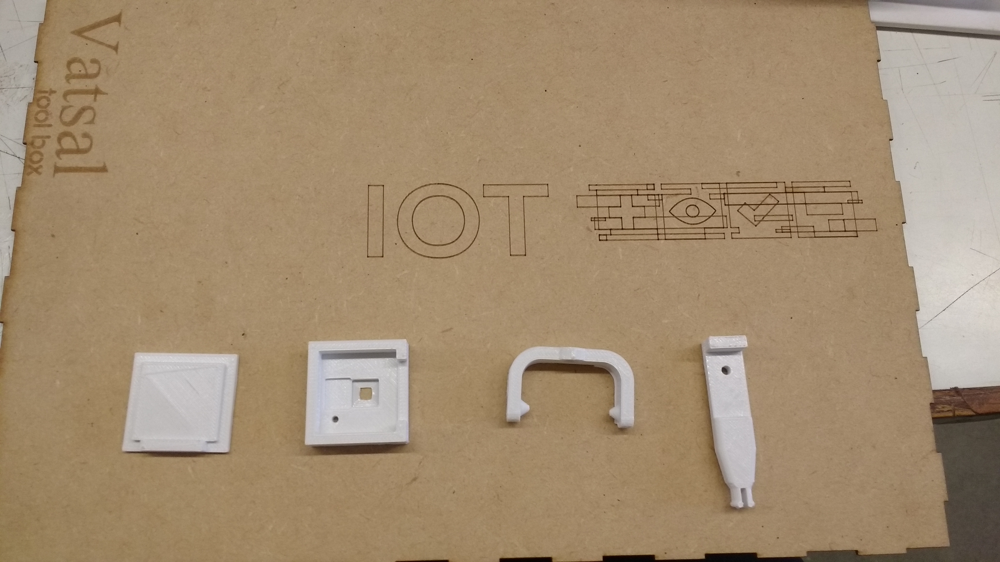
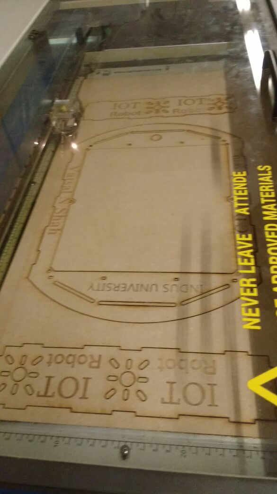
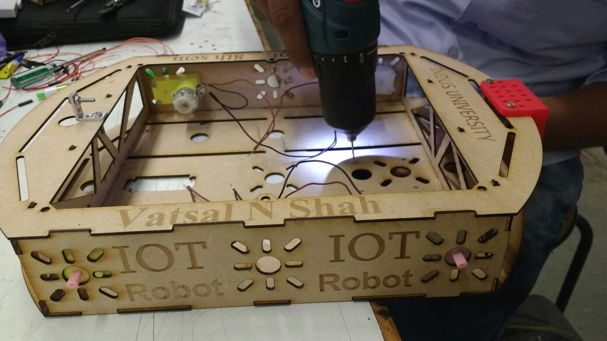
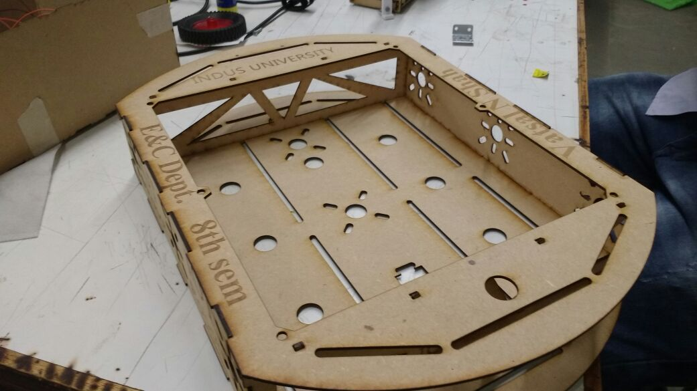
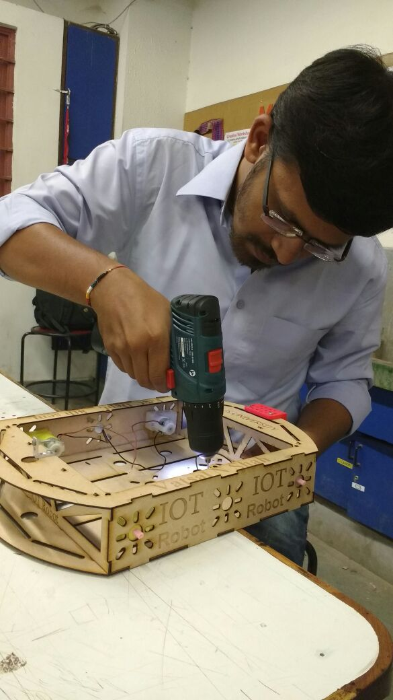

- Using machine Ultimaker 2 case of Raspberry Pi camera is designed and working with it is shown below. The full body requires time around 1 hours to print it. 

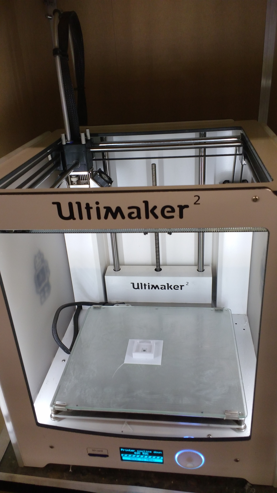
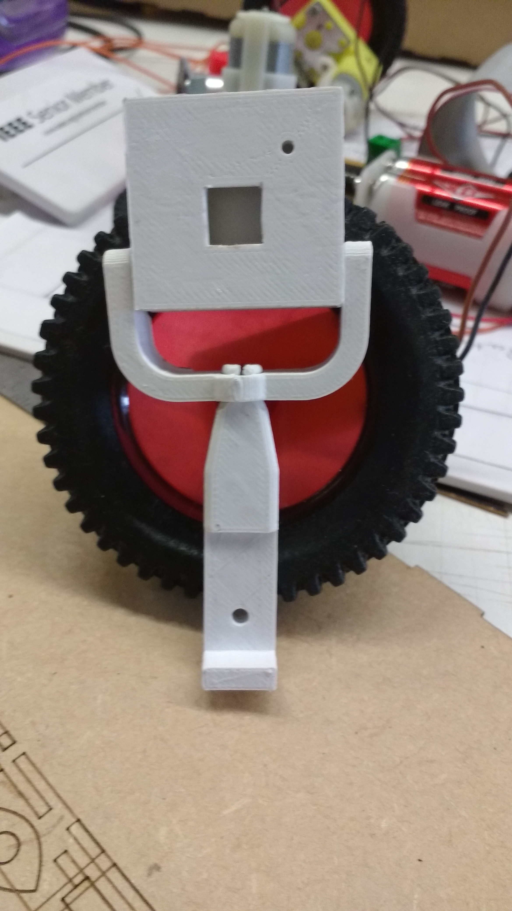
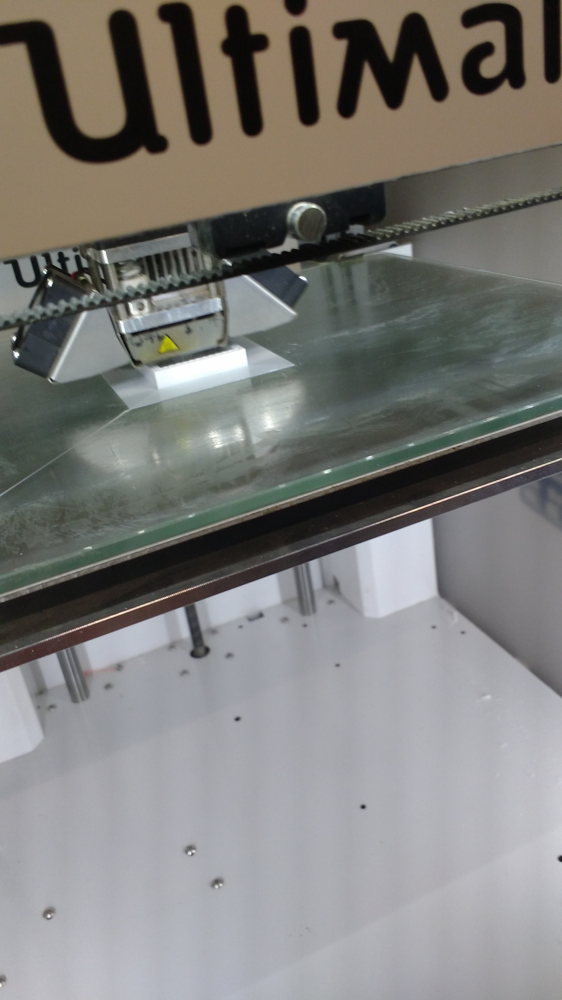

## 9. Results

- The aim of the project is to develop a Robot on IoT based concept. 
- It is working as buddy or family Member because you have to command it and control from anywhere at any time. 
- If a personal wants to find something he/she has to command it from live steaming can see the actual scenario at that place and easily find out that object.
-  It works as to take care for children’s, pet at home, too. 

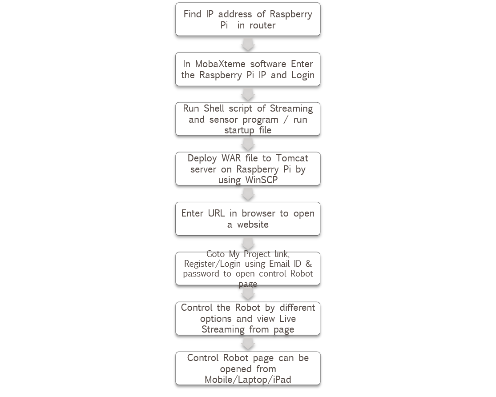

Final IoT Robot design is as shown below: 

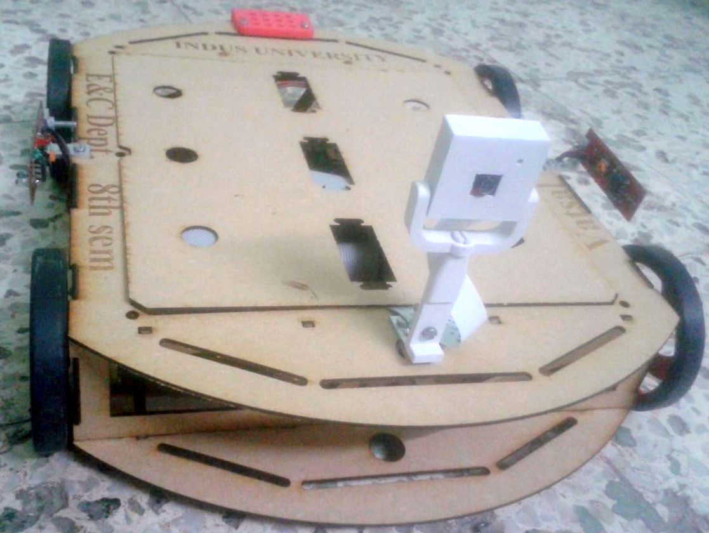

## 10. Conclusion

- To get to the aim of a project there will be always a set of objectives, to achieve that objectives we need to know how where and with what resource is the step towards completing the objectives taken. 
- Now in this project too to get to the aim of the project there was a set of objectives, which gradually changed as the project research was completed and then while testing a certain technology the objectives again changed due to the failure of the method. Now the first thing of the project is a good research, I had to do a wide and a strong research before I started to put my objectives as this technology was new in market. 
The research for the project was done using Advanced Google search and also from the search engines available in the student portal like tutorials, pi4j, w3school and raspberry pi.
- The Google advanced search is the one that was more widely used as it is a new technology and there are very less articles or journals published regarding the raspberry pi technology and IoT. 
- Each stage of the project was tested after every part of it was completed and then moved on to the next one. During the course of the project I gained knowledge of Java I also gained knowledge of the raspberry pi technology and what the small computer is capable of. 
- After knowing the capabilities of raspberry pi and the applications it could have in the field of robotics, and IoT it actually has made me to think of doing more research work on the raspberry pi for the robotic and IoT applications. 
- The challenges that I faced during the course of the project were that of the time constrain, as I had to learn about the raspberry pi and then learn programming in Java and HTML. 
- Then during the programming of the server client interfaces the problems of calling functions with a button press. One of the main challenges that No output comes when some functions are called from software side. Other than the small problem the buddy robot works fine and meets all its purpose. 
- If given an opportunity to work again on the same technology i.e. the raspberry pi and IoT technology or on a project like this where the raspberry pi is used for any kind off application I would be happy to take it up.

## 11. Future Work

In the future this raspberry pi technology can be used in various different fields of work. The buddy robot can be made autonomous with the help of more sensor, gyroscope, compass and a GPS. So that it can be set to a target or a specific area where in can monitor. The robot can also be developed into an advanced robot toy for young people. Others future works described below:
-	Face recognition: All the family members face images are stored in controller when an unknown person will come at door, it will create alert and click the image and send it to user. 
-	In changing the Mechanical design work using the same concept, different functions as Open the door, Turn on/off switch, bring newspaper for user, etc work can be done.
-	Adding the Pneumatics design in Mechanical design robot can walk, go up and down and it will be control from anywhere at any time. 
